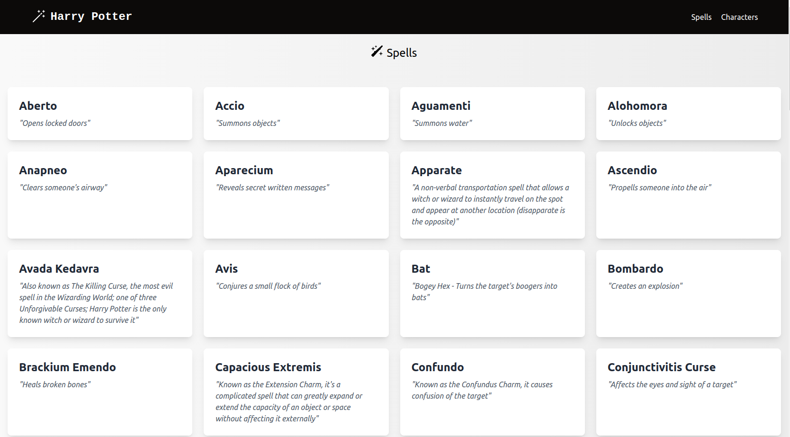
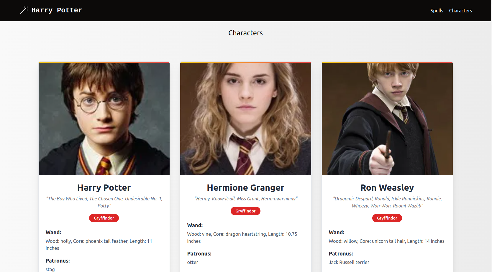

# Harry Potter API React App

This is a React application that fetches and displays data from the Harry Potter API. The app consists of two main components: **Spells** and **Characters** each designed to provide a user-friendly interface for browsing spells and characters from the Harry Potter.

## Table of Contents

- [Features](#features)
- [Getting Started](#getting-started)
- [Installation](#installation)
- [Usage](#usage)


## Features

- Display a list of spells along with their name and description.
- Pagination for the characters so that users can move through the list.
- Loading state management for the improvement of user experience during fetching is incorporated.
- Responsive design by using Tailwind CSS.

## Getting Started

### Prerequisites

Before you begin, ensure you have the following installed:

- [Node.js](https://nodejs.org/en/download/) (version 14 or higher)
- [npm](https://www.npmjs.com/get-npm) (Node package manager, comes with Node.js)

### Installation

1. Clone the repository:

   ```bash
   git clone https://github.com/Caleb-ne1/harry-potter-api-react-app.git
   ```

2. Navigate to the project directory:

```bash
cd harry-potter-api-react-app
```
3. Install the necessary packages:

```bash
npm install
```

### Usage
To run the application use the following command:

```bash
npm start
```

This will start the development server and open the app in your default browser. You can now navigate to the Spells and Characters sections to view the data fetched from the Harry Potter API.

## API Reference
```bash
https://www.freepublicapis.com/harry-potter-api
```
